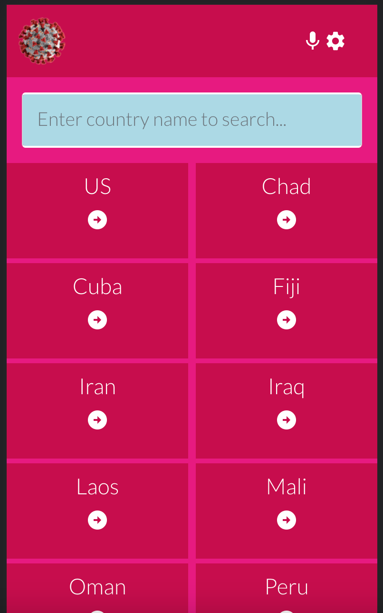
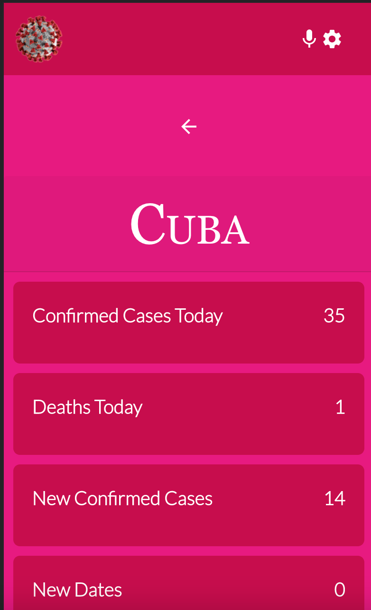

## Covid-19 Metrics App

## Table of Contents

* [About the Project](#about-the-project)
* [Built With](#built-with)
* [Getting Started](#getting-started)
* [Contributing](#contributing)
* [Authors](#author)
* [Acknowledgements](#acknowledgements)

## About Project

This is a React app that fetch metrics from Narrativa API. It is about building a mobile web application to check a list of Covid-19 metrics (numeric values).





## [Live Demo - Netlify](https://aesthetic-cupcake-19dcf4.netlify.app)
## [Live Demo Video - Loom](https://www.loom.com/share/ff5b88499f064236867a193d28c8f8e2)
<!-- ## [Live Demo ]() -->

## Built With

* ReactJS
* Redux
* Material UI
* HTML5
* CSS3


## Getting Started

* Clone this repo <https://github.com/white3d/react-covid-metrics-app.git>

    ```bash
    git clone https://github.com/white3d/react-covid-metrics-app.git
    ```

* Navigate to react-covid-metrics-app folder/directory

    ```bash
    cd react-covid-metrics-app
    ```

* On the comandline, at the project's root, run ```npm install``` to install app dependencies

* Next, run ```npm start``` which will run the app in the development mode.

* Open [http://localhost:3000](http://localhost:3000) to view it in the browser.

* ALTERNATIVELY

  * Just run ```npm run build``` which will build the project and generate output files into the ```build``` directory.

  * Go to ```build``` directory and manually open ```index.html``` to interact with the app


## Contributing

Contributions, issues, and feature requests are welcome!

Feel free to check the [issues page](../../issues)

  1. Fork the Project
  2. Create your Feature Branch (`git checkout -b feature/newFeature`)
  3. Commit your Changes (`git commit -m 'Add some newFeature'`)
  4. Push to the Branch (`git push -u origin feature/newFeature`)
  5. Open a Pull Request

## Authors

👤 **Edward Odhiambo**

- GitHub: [@whit3d](https://github.com/white3d)
- Twitter: [@odhiambo_ed](https://twitter.com/odhiambo_ed)
- LinkedIn: [Edward Odhiambo](https://www.linkedin.com/in/edward-odhiambo-6a462a21b/)

## Acknowledgements

* Original design idea by [Nelson Sakwa on Behance](https://www.behance.net/sakwadesignstudio)
* [ReactJS Organization](https://reactjs.org/) for the amazing [Documentation](https://reactjs.org/docs/getting-started.html) on React.
* [Redux Organization](https://redux.js.org/) for the amazing [Redux Essentials Tutorial](https://redux.js.org/tutorials/essentials/part-1-overview-concepts) on React.

## Show your support

Give a ⭐️ if you like this project!
